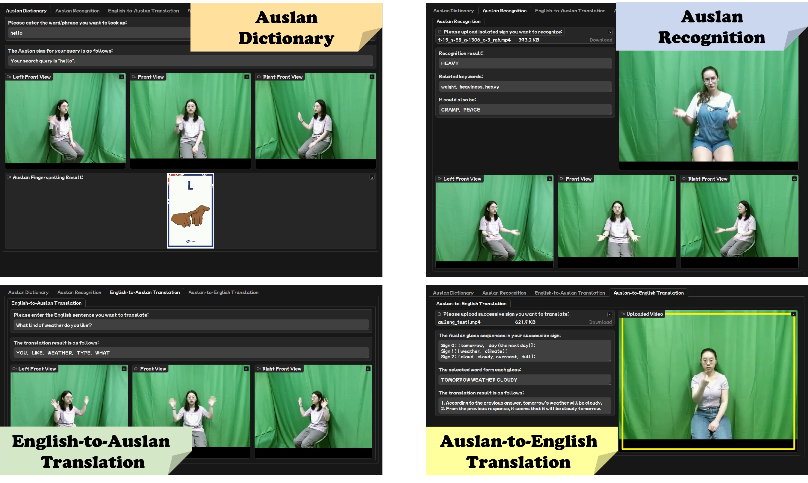

# AuslanWeb

## AuslanWeb: A Scalable Web-Based System for Australian Sign Language Communication

Effective communication between the deaf community and hearing individuals facilitates social inclusion, equal opportunities, and the dignity of vulnerable populations.  However, Auslan, as the sign language specific to Australia, still lacks reliable tools to support effective interaction.  Existing region-specific sign language systems are constrained by limited training datasets and narrow topic domains, rendering them ineffective for bridging the linguistic gaps between sign languages and spoken languages.  To address these challenges, we propose AuslanWeb, a web-based system for translation of both isolated and successive sign language.
For the former, **AuslanWeb** achieves high-precision mapping between isolated signs (glosses) and spoken language words or phrases through a multimodal recognition system and a versatile sign language dictionary.
For the latter, it leverages the advanced contextual understanding and text generation capabilities of Large Language Models (LLMs) to support bidirectional translation between successive sign language videos and long-form spoken language.
By integrating linguistic structure with advanced AI capabilities, AuslanWeb overcomes the limitations of dataset dependency and enhances the scalability of sign language translation systems. 
The effectiveness of the system is further validated through user feedback, receiving consistent praise from Auslan experts, Australian deaf individuals, and volunteers.

## User Interface Demonstration
The user interface of our system has been meticulously crafted to ensure accessibility, clarity, and functionality. 
The design enables users to seamlessly navigate through the key modules of the Auslan dictionary, recognition, and translation system. 
A detailed view of the interface is shown in following figure.
The user interface emphasizes intuitive navigation, responsive design, and a unified layout. 
Each module is developed to operate independently while maintaining consistent design principles, ensuring an inclusive experience for all users.

## AuslanWeb Demo Video

[Download or play the demo video.](Demo_Video/Demo.mp4)

